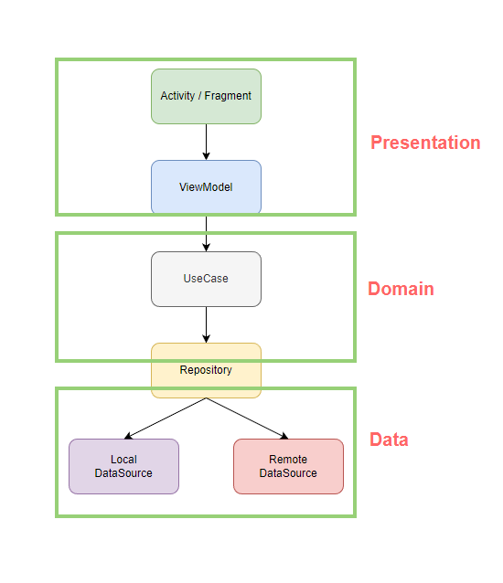

# Memory-of-Music-android

Clean-Architecture 음악 기록 앱

[플레이스토어 다운로드 링크](https://play.google.com/store/apps/details?id=com.hanyeop.mom)

## 📱 프로젝트 소개

특정 음악을 듣게 되면 그때 당시의 기억이 생생히 떠오르곤 합니다.  
이 어플리케이션은 내가 감명깊게 들은 음악들을 기록해놓고 다음에 한번씩 곱씹어보면서 추억에 젖을 수 있도록 도와줍니다.

### 음악, 앨범 검색

- 음악과 앨범을 검색할 수 있습니다.

### 음악, 앨범 기록

- 음악과 앨범을 내용과 평점을 통해 기록할 수 있습니다.

### 기록 관리

- 기록한 내용들을 수정하고 관리할 수 있습니다.

### 재생 기능

- 즉시 유튜브로 기록한 음악들을 재생할 수 있습니다.

### 칼럼

- 개발자가 직접 추천해주는 추천곡과 에세이를 확인할 수 있습니다.

## 🔨 프로젝트 구조

### Presentation, Domain, Data 3가지 모듈로 레이어 세분화

- Presentation (app + presentation)

  - 화면, 사용자 입력 처리 레이어
  - Activity, Fragment, ViewModel
  - app 모듈에서는 DI만 진행
  - Domain, Data 레이어 포함

- Domain

  - 앱의 비즈니스 로직 포함 레이어
  - Model, UseCase, Repository interface
  - 의존성 없이 독립적

- Data
  - 서버,로컬 DB와 데이터 통신 레이어
  - DataSource, Model, Repository 구현부, Dao
  - Domain 레이어 포함

## 🎨 사용한 라이브러리

| Name              | Description                                            |
| ----------------- | ------------------------------------------------------ |
| Retrofit          | HTTP 통신을 도와주는 라이브러리                        |
| Coroutine         | 비동기 처리 라이브러리                                 |
| Coroutine Flow    | 비동기 데이터 스트림                                   |
| Glide             | 이미지 로딩 라이브러리                                 |
| Dagger Hilt       | 의존성 주입 라이브러리                                 |
| Navigation        | 프래그먼트를 쉽게 관리할 수 있도록 도와주는 라이브러리 |
| XMLConverter      | XML 데이터 변환 라이브러리                             |
| SimpleRatingBar   | RatingBar 커스텀 라이브러리                            |
| SeekbarRangedView | Seekbar 범위 설정 커스텀 라이브러리                    |
| Firebase          | 통신을 위한 서버                                       |
| Biometric         | 생체인증 라이브러리                                    |
| Room              | 안드로이드 DB 라이브러리                               |
| RoomBackup        | DB 백업, 복원 라이브러리                               |
| BottomBar         | 바텀 네비게이션 커스텀 라이브러리                      |

## 📝 Commit Type

- [ADD] : 파일, 기능 추가
- [REMOVE] : 파일, 기능 제거
- [UPDATE] : 파일, 기능 수정
- [REFACTOR]: 기능 변경 없이 동작 구조만 수정
- [STYLE] : 기능 변경 없이 UI만 수정
- [FIX] : 버그 수정
- [CHORE] : build, manifest 수정
- [TEST] : test 코드 작성
