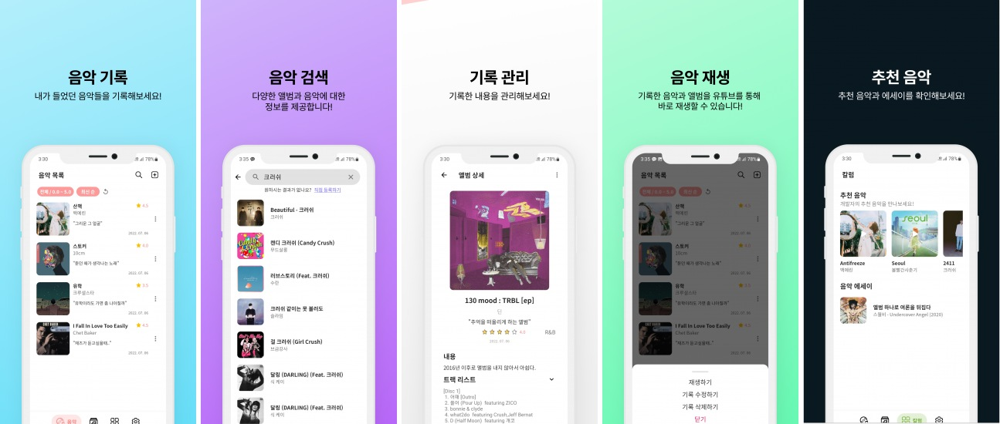

# Memory-of-Music-android

Clean-Architecture 음악 기록 앱

[플레이스토어 다운로드 링크](https://play.google.com/store/apps/details?id=com.hanyeop.mom)

## 📱 프로젝트 소개

특정 음악을 듣게 되면 그때 당시의 기억이 생생히 떠오르곤 합니다.  
이와 같이 음악과 기억은 밀접하게 연관되어 있습니다. 
이 어플리케이션은 내가 감명깊게 들은 음악들을 기록해놓고 다음에 한번씩 곱씹어보면서 추억에 젖을 수 있도록 도와줍니다.

### 음악, 앨범 검색

- 음악과 앨범을 검색할 수 있습니다.

### 음악, 앨범 기록

- 음악과 앨범을 내용과 평점을 통해 기록할 수 있습니다.

### 기록 관리

- 기록한 내용들을 수정하고 관리할 수 있습니다.

### 재생 기능

- 즉시 유튜브로 기록한 음악들을 재생할 수 있습니다.

### 칼럼

- 개발자가 직접 추천해주는 추천곡과 에세이를 확인할 수 있습니다.

## 🔨 프로젝트 구조

## 📝 Commit Type

- [ADD] : 파일, 기능 추가
- [REMOVE] : 파일, 기능 제거
- [UPDATE] : 파일, 기능 수정
- [REFACTOR]: 기능 변경 없이 동작 구조만 수정
- [STYLE] : 기능 변경 없이 UI만 수정
- [FIX] : 버그 수정
- [CHORE] : build, manifest 수정
- [TEST] : test 코드 작성
